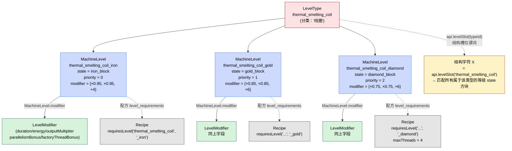

# A_Level_Machine — 等级系统（热冶炼炉）

本文演示 MMCR 的 **Level 系统**：机器结构里有一个"等级槽位"，槽位上摆哪一块代表方块决定当前机器等级，不同等级叠加不同的配方修饰器。代码对应 [Java 端的 THERMAL_SMELTING_FURNACE](../JavaAPI/THERMAL_SMELTING_FURNACE)。

## 机器简介

`A_Level_Machine` 由三个文件组成：

- `example/startup_scripts/A_Level_Machine.js` — 注册 `kubejs_thermal_smelting_furnace` 机器，再注册一个等级类型（`thermal_smelting_coil`）和三个等级（铁、金、钻石）。
- `example/server_scripts/structure/A_Level_Machine.js` — 3×4×3 的多方块结构，外壳用 `levelSlot("...thermal_smelting_coil")` 匹配等级槽位。
- `example/server_scripts/recipe/A_Level_Machine.js` — 三条配方，铁 / 金 / 钻石线圈各一条；每条用 `level_requirements` 限定自己需要的等级。

Level 系统是 Modifier 系统的"配方侧"补充。Modifier 由结构上的方块动态决定；Level 由结构上**指定槽位**的方块决定，影响该机器能跑哪些配方。

## 本教程涉及的文件

| 文件 | 阶段 | 角色 |
| --- | --- | --- |
| `example/startup_scripts/A_Level_Machine.js` | `MMCREvents.startup` | 注册机器 + 注册等级类型 + 注册三个等级 |
| `example/server_scripts/structure/A_Level_Machine.js` | `MMCREvents.server` | 在结构字符上绑定 `levelSlot` |
| `example/server_scripts/recipe/A_Level_Machine.js` | `ServerEvents.recipes` | 三条数据驱动配方，各自带 `level_requirements` |

## 本教程涉及的 API 跳转表

| KubeJS API | 文档位置 |
| --- | --- |
| `MMCRStartupEventJS.createLevelType(...)` / `.createLevel(...)` | [API/KubeJS#mmcrstartupeventjs](../API/KubeJS#mmcrstartupeventjs) |
| `LevelTypeBuilderJS` | [API/KubeJS#leveltypebuilderjs](../API/KubeJS#leveltypebuilderjs) |
| `MachineLevelBuilderJS` | [API/KubeJS#machinelevelbuilderjs](../API/KubeJS#machinelevelbuilderjs) |
| `KubeJSApi.levelSlot(...)` / `.levelRequirement(...)` | [API/KubeJS#kubejsapi](../API/KubeJS#kubejsapi) |
| `MachineRecipeBuilderJS.requiresLevel(...)` | [API/KubeJS#machinerecipebuilderjs](../API/KubeJS#machinerecipebuilderjs) |
| `MachineRecipeSchema` 字段 `level_requirements` | [API/KubeJS#machinerecipeschema](../API/KubeJS#machinerecipeschema) |

## 机器定义详解（`MMCREvents.startup`）

打开 [A_Level_Machine.js（启动期）](https://github.com/Nibelungorum/ModularMachinery-Community-Refoxed/blob/main/example/startup_scripts/A_Level_Machine.js)：

```js
// Use the level system and a shared structure.

MMCREvents.startup(event => {

    // Register the machine that uses levels.
    const builder = event
        .createMachine("mmcr_kubejs:kubejs_thermal_smelting_furnace")
        .displayNameKey("machine.mmcr_kubejs.kubejs_thermal_smelting_furnace")
        .recipeFamily("mmcr_kubejs:kubejs_thermal_smelting_furnace")
        .allowParallelism()
        .allowMultithreading()
        .maxParallelAmount(32)
        .appearance("minecraft:smooth_basalt")

    builder.register()

    // Register the level type before registering individual levels.
    event
        .createLevelType("mmcr_kubejs:thermal_smelting_coil")
        .displayNameKey('level.mmcr_kubejs.thermal_smelting_coil')
        .register()

    // Register three levels under that type.
    event.createLevel("mmcr_kubejs:thermal_smelting_coil_iron")
        .type("mmcr_kubejs:thermal_smelting_coil")
        .priority(0)
        .state('minecraft:iron_block')
        .modifier({
            durationMultiplier: 0.95,
            energyMultiplier: 0.95,
            parallelismBonus: 4
        })
        .register()

    event.createLevel("mmcr_kubejs:thermal_smelting_coil_gold")
        .type("mmcr_kubejs:thermal_smelting_coil")
        .priority(1)
        .state('minecraft:gold_block')
        .modifier({
            durationMultiplier: 0.85,
            energyMultiplier: 0.85,
            parallelismBonus: 6
        })
        .register()

    event.createLevel("mmcr_kubejs:thermal_smelting_coil_diamond")
        .type("mmcr_kubejs:thermal_smelting_coil")
        .priority(2)
        .state('minecraft:diamond_block')
        .modifier({
            durationMultiplier: 0.75,
            energyMultiplier: 0.75,
            parallelismBonus: 6
        })
        .register()
})
```

### 机器定义本身没有 `.allowLevels(...)`

机器层没有"开启等级系统"的开关——只要在结构里用了 [`api.levelSlot(...)`](../API/KubeJS#kubejsapi)，就自动启用该机器的等级系统。`.allowMultithreading()` + `.maxParallelAmount(32)` 与等级系统无关，只是给高等级配方多开几个线程用。

### 等级类型 `createLevelType(...)`

```js
event
    .createLevelType("mmcr_kubejs:thermal_smelting_coil")
    .displayNameKey('level.mmcr_kubejs.thermal_smelting_coil')
    .register()
```

等级类型（`LevelType`）是"等级分类"，代表一个可被升级的"维度"。比如本教程的"线圈"就是一个维度——机器结构上有一个槽位专门放线圈；铁 / 金 / 钻石线圈都属于这个维度。

链式三件事：

- `.displayNameKey(...)`：本地化键。命名建议 `level.<命名空间>.<类型名>`。
- `.register()`：把等级类型提交到当前等级注册窗口。**必须在具体等级之前调用**，否则 `createLevel(...).type(...)` 会因为找不到类型而抛 `IllegalStateException`，详见 [API/KubeJS#leveltypebuilderjs](../API/KubeJS#leveltypebuilderjs) 的"注意事项"。

### 具体等级 `createLevel(...)`

```js
event.createLevel("mmcr_kubejs:thermal_smelting_coil_iron")
    .type("mmcr_kubejs:thermal_smelting_coil")
    .priority(0)
    .state('minecraft:iron_block')
    .modifier({ durationMultiplier: 0.95, energyMultiplier: 0.95, parallelismBonus: 4 })
    .register()
```

每个具体等级属于一个等级类型，由一个 `state` 方块标识，并自带一组修饰参数。链式四件事：

- `.type(typeId)`：必填，指定父等级类型。
- `.priority(int)`：可选，优先级（数值越大越优先）。
- `.state(Object)`：必填，代表该等级的方块。`Object` 可以是字符串（方块 ID，使用默认状态）或 `BlockState`。
- `.modifier(Map)`：可选，定义该等级带来的修饰参数。可选键：

| 键 | 含义 |
| --- | --- |
| `durationMultiplier` | 配方耗时乘数（> 0） |
| `energyMultiplier` | 配方能耗乘数（> 0） |
| `outputMultiplier` | 配方输出乘数（> 0） |
| `parallelismBonus` | 配方并行度加成 |
| `factoryThreadBonus` | 工厂线程加成 |

铁 / 金 / 钻石线圈的 `modifier` 分别是 `{×0.95, ×0.95, +4}` / `{×0.85, ×0.85, +6}` / `{×0.75, ×0.75, +6}`。

### 等级类型 / 等级 / 修饰器的关系图



图中三种对象：

- **LevelType**（粉）：分类，决定"什么算线圈"。
- **MachineLevel**（蓝）：具体等级，决定"铁 / 金 / 钻石线圈是什么方块、加成多少"。
- **LevelModifier**（绿）：MachineLevel 自带的修饰参数集合；运行时叠加到配方上。

虚线指向**使用者**：

- 结构用 [`api.levelSlot(typeId)`](../API/KubeJS#kubejsapi) 引用 LevelType 来匹配所有该类型的等级 state 方块。
- 配方用 `level_requirements` 数组引用 MachineLevel（也可用 [`api.levelRequirement(typeId, levelId)`](../API/KubeJS#kubejsapi) 在编程式构建器中表达）。

### `LevelModifier` 与 `ModifierDefinition` 的区别

Level 系统自带的修饰器（`LevelModifier`）和 A_Modifier_Machine 的修饰器（`ModifierDefinition`）使用不同的字段名：

| 修饰器来源 | 数据结构 | 字段 |
| --- | --- | --- |
| `MachineLevel.modifier(map)` | `LevelModifier`（不可变记录） | `durationMultiplier` / `energyMultiplier` / `outputMultiplier` / `parallelismBonus` / `factoryThreadBonus` |
| `api.modifierDefinition([...])` | `ModifierDefinition`（不可变列表） | `target` / `io` / `value` / `operation` / `chance`（每条规则） |

前者是"等级加成"的语义（耗时 × 0.95、并行 +4），后者是"配方规则"的语义（duration × 0.5、`item` `output` × 2）。本教程只使用前者。

### 启动期不可热加载

机器、等级类型、等级全部由启动期窗口统一管理。重启游戏才能生效。详见 [API/KubeJS#mmcrstartupeventjs](../API/KubeJS#mmcrstartupeventjs)。

## 结构详解（`MMCREvents.server`）

打开 [A_Level_Machine.js（结构阶段）](https://github.com/Nibelungorum/ModularMachinery-Community-Refoxed/blob/main/example/server_scripts/structure/A_Level_Machine.js)：

```js
MMCREvents.server(event => {
    const api = event.getAPI()
    const structure = event.createStructure("mmcr_kubejs:kubejs_thermal_smelting_furnace")

    structure
        .pattern(['AAA','XXX','XXX','AAA'])
        .pattern(['AAA','X X','X X','ADA'])
        .pattern(['ABA','XXX','XXX','AAA'])
        .set('X', api.levelSlot("mmcr_kubejs:thermal_smelting_coil"))  // ← 等级槽位
        .set('A', api.anyOf(
            api.anyOfItemInput(),
            api.anyOfItemOutput(),
            api.anyOfEnergyInput(),
            api.parallelControllers(),
            api.factoryController(),
            api.block('minecraft:smooth_basalt')
        ))
        .set('D', api.block('minecraft:reinforced_deepslate'))
        .controller('B')
        .build()
})
```

### `api.levelSlot(typeId)` 把字符升级为等级槽位

```js
.set('X', api.levelSlot("mmcr_kubejs:thermal_smelting_coil"))
```

[`api.levelSlot(typeId)`](../API/KubeJS#kubejsapi) 返回 [`LevelSlot`](../API/KubeJS#kubejsapi)，匹配属于 typeId 等级类型的**任一 state 方块**——与 `api.block(...)` 只匹配单一方块不同，槽位匹配的是"一组方块"，具体哪一组由所有 `MachineLevel.state(...)` 字段动态决定。本教程的 `X` 可以匹配铁块 / 金块 / 钻石块。

### 端口与控制器

`A` 是端口并集 + 并行控制器 + 工厂控制器 + smooth_basalt（默认外观）。`B` 是控制器。`D` 是 deepslate 装饰方块。结构在生产构建中不可热加载，详见 [API/KubeJS#machinestructurebuilderjs](../API/KubeJS#machinestructurebuilderjs)。

## 配方详解（`ServerEvents.recipes`）

打开 [A_Level_Machine.js（配方阶段）](https://github.com/Nibelungorum/ModularMachinery-Community-Refoxed/blob/main/example/server_scripts/recipe/A_Level_Machine.js)：

```js
ServerEvents.recipes( event => {
    // 铁线圈：10000 煤 + 8 生铁 → 9 铁锭
    event.custom({
        type: 'mmcr:machine_recipe',
        machine: 'mmcr_kubejs:kubejs_thermal_smelting_furnace',
        tick_time: 300,
        level_requirements: [
            {
                type: 'mmcr_kubejs:thermal_smelting_coil',
                level: 'mmcr_kubejs:thermal_smelting_coil_iron'
            }
        ],
        requirements: [
            { type: 'minecraft:item', io: 'input',  item: 'minecraft:coal',     count: 10000 },
            { type: 'minecraft:item', io: 'input',  item: 'minecraft:raw_iron', count: 8 },
            { type: 'minecraft:item', io: 'output', stack: { id: 'minecraft:iron_ingot', count: 9 } },
            { type: 'neoforge:energy', io: 'input', fe_per_tick: 10 }
        ]
    })

    // 金线圈 / 钻石线圈的结构相同：仅 level_requirements 与 requirements 不同。
    // 完整代码见上面的源文件链接。
})
```

三条配方只差 `level_requirements.level` 与 `requirements`：

| 配方 | 限定等级 | 输入 | 输出 | 备注 |
| --- | --- | --- | --- | --- |
| 铁线圈 | `thermal_smelting_coil_iron` | 10000 煤 + 8 生铁 | 9 铁锭 | 10 FE/tick |
| 金线圈 | `thermal_smelting_coil_gold` | 1 煤 + 8 生金 | 9 金锭 | 12 FE/tick |
| 钻石线圈 | `thermal_smelting_coil_diamond` | 1 煤 + 8 生铜 | 9 铜锭 | 10 FE/tick，`max_threads: 4` |

### 数据驱动配方的 `level_requirements` 字段

```js
level_requirements: [
    {
        type: 'mmcr_kubejs:thermal_smelting_coil',
        level: 'mmcr_kubejs:thermal_smelting_coil_iron'
    }
]
```

这是数据驱动配方的顶层字段，对应 [MachineRecipeSchema](../API/KubeJS#machinerecipeschema) 上的 `level_requirements` 键。数组中每条 `{ type, level }`：

- `type`：等级类型 ID（与启动期 `createLevelType(...)` 一致）。
- `level`：具体等级 ID（与启动期 `createLevel(...)` 一致）。等级必须属于指定类型，否则在配方注册阶段抛异常。

语义：要求机器结构上的对应等级槽位摆出指定等级的代表方块，配方才会被选中。编程式等价物是 [`MachineRecipeBuilderJS.requiresLevel(typeId, levelId)`](../API/KubeJS#machinerecipebuilderjs) 或 [`KubeJSApi.levelRequirement(typeId, levelId)`](../API/KubeJS#kubejsapi)，底层用同一份 `LevelRequirement`。

### `max_threads` 字段

```js
max_threads: 4
```

数据驱动配方顶层字段，限制该配方最多占用几个工厂线程。钻石线圈配方 `max_threads: 4`，意味着同一时间最多 4 个钻石线圈配方实例并发跑（即便工厂控制器允许多线程）。详见 [API/KubeJS#machinerecipeschema](../API/KubeJS#machinerecipeschema)。

数据驱动配方支持热加载，修改后 `/reload` 即可。

## 特殊机制：Level 系统

### `MachineLevel.modifier` vs `ModifierDefinition`

两个修饰器入口的区别：

| 系统 | 触发 | 作用时机 | 字段 |
| --- | --- | --- | --- |
| Modifier（A_Modifier_Machine） | 结构上指定位置的方块 | 配方运行时动态叠加 | `target` / `io` / `value` / `operation` / `chance` |
| Level（本教程） | 结构上等级槽位的方块 | 配方运行时叠加 | `durationMultiplier` / `energyMultiplier` / `outputMultiplier` / `parallelismBonus` / `factoryThreadBonus` |

Level 是"机器固定属性"，Modifier 是"玩家动态摆放"。Level 的等级由结构文件决定（不能改），Modifier 的位置可由玩家自由决定摆什么方块。

### 配方侧 vs 编程式

数据驱动 `event.custom({ level_requirements: [...] })` 与编程式 `MachineRecipeBuilderJS.requiresLevel(...)` 在底层用同一份 [`LevelRequirement`](../API/KubeJS#kubejsapi)。脚本中数据驱动写法更直观，复杂条件构建时再用编程式。

### 与 Java 端的对比

A_Level_Machine 与 [THERMAL_SMELTING_FURNACE](../JavaAPI/THERMAL_SMELTING_FURNACE) 同构：Java 端 `LevelType.builder().displayNameKey(...)` + `LevelTypeRegistry.register(...)` ↔ KubeJS 端 `event.createLevelType(...).displayNameKey(...).register()`；Java 端 `LevelSlot.of(typeId)` ↔ `api.levelSlot(typeId)`；Java 端 `MachineRecipeBuilder.requiresLevel(...)` ↔ 数据驱动 `level_requirements` 字段。

## 与其他教程的对比

### 与 A_Simple_Machine 的对比

| 维度 | A_Simple_Machine | A_Level_Machine |
| --- | --- | --- |
| 启动期独有注册 | 无 | 等级类型 + N 个等级 |
| 结构层独有调用 | 普通 `.set(...)` | `.set('X', api.levelSlot(...))` |
| 配方层独有字段 | 无 | `level_requirements` 数组 + `max_threads` |
| 启动期重启游戏 | 是 | 是 |

### 与 A_Modifier_Machine 的对比

| 维度 | A_Modifier_Machine | A_Level_Machine |
| --- | --- | --- |
| 修饰器来源 | 玩家在结构上摆方块（自由） | 等级槽位对应的等级 state 方块（受等级 ID 约束） |
| 修饰器数据 | `ModifierDefinition`（`api.modifierDefinition([...])`） | `LevelModifier`（`MachineLevel.modifier({...})`） |
| 配方限定 | 不限配方，所有配方共享修饰器 | 通过 `level_requirements` 限定哪些配方能跑 |
| 启动期额外注册 | `registerModifier` + `registerModifierItem` | `createLevelType` + `createLevel` × N |

A_Modifier_Machine 的修饰器对所有配方生效；A_Level_Machine 的等级修饰器只对带了对应 `level_requirements` 的配方生效——这是两个系统在"配方限定"语义上的根本差异。

### 与 Java 端 THERMAL_SMELTING_FURNACE 的对比

参见 [JavaAPI/THERMAL_SMELTING_FURNACE](../JavaAPI/THERMAL_SMELTING_FURNACE)。Java 端用 `LevelType.builder()` 流式 API；KubeJS 端用 `event.createLevelType(...).register()` 把所有这些压成几行。

## 延伸阅读

- [API/KubeJS#createleveltypestring-id--leveltypebuilderjs](../API/KubeJS#mmcrstartupeventjs) — 等级类型入口。
- [API/KubeJS#leveltypebuilderjs](../API/KubeJS#leveltypebuilderjs) — `LevelTypeBuilderJS` 完整方法。
- [API/KubeJS#createlevelstring-id--machinelevelbuilderjs](../API/KubeJS#mmcrstartupeventjs) — 具体等级入口。
- [API/KubeJS#machinelevelbuilderjs](../API/KubeJS#machinelevelbuilderjs) — `MachineLevelBuilderJS` 完整方法（含 `.modifier(...)` 字段）。
- [API/KubeJS#levelslotstring-typeid--levelslot](../API/KubeJS#kubejsapi) — 结构层等级槽位谓词。
- [API/KubeJS#levelrequirementstring-typeid-string-levelid--levelrequirement](../API/KubeJS#kubejsapi) — 编程式等级要求对象。
- [API/KubeJS#machinerecipebuilderjs](../API/KubeJS#machinerecipebuilderjs) — 编程式配方构建器的 `requiresLevel(...)`。
- [API/KubeJS#machinerecipeschema](../API/KubeJS#machinerecipeschema) — 数据驱动配方字段全集。
- [JavaAPI/THERMAL_SMELTING_FURNACE](../JavaAPI/THERMAL_SMELTING_FURNACE) — 同一台热冶炼炉的 Java 实现。
- [A_Simple_Machine](A_Simple_Machine) — 不使用等级系统的基础机器。
- [A_Module_Machine](A_Module_Machine) — 上一节 HOST + MODULE 教程。
- [A_Modifier_Machine](A_Modifier_Machine) — 下一节 Modifier 系统教程。